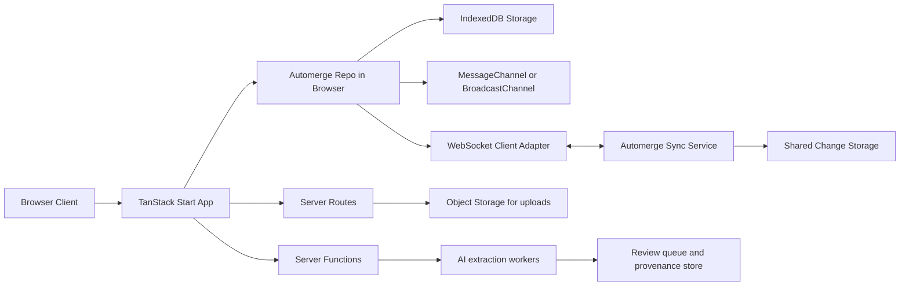
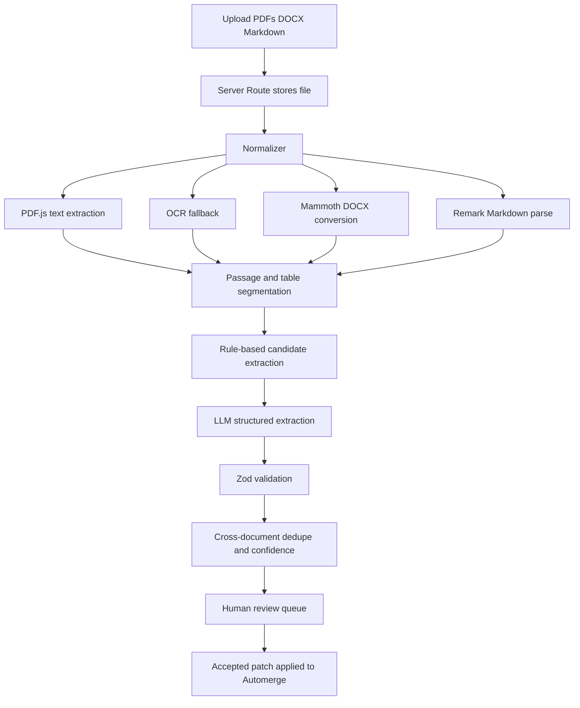

# Collaborative Nested PERT Design with Automerge, TanStack, and React Flow

## Executive summary

The strongest architecture for this product is a **local-first TanStack Start application** that treats **Automerge documents as the source of truth for collaborative project state**, while using **TanStack Query, Server Functions, and Server Routes** only for non-CRDT concerns such as file uploads, AI extraction jobs, authentication, and observability. Automerge Repo is specifically designed to wrap Automerge with storage and networking, using a `Repo` plus pluggable `StorageAdapter` and `NetworkAdapter` instances; it can persist data locally, sync across peers, and keep full document history for point-in-time views and diffs. TanStack Start is a good shell around that because it provides SSR, streaming, middleware, server functions, and server routes, while TanStack Router, Table, Form, Query, and Virtual cover the rest of the application surface cleanly. React Flow is a good diagram renderer because it is built for node-based editors, and its ecosystem examples show practical integration with layout engines such as dagre and ELK. citeturn4view0turn4view1turn4view2turn4view3turn39search0turn39search11turn23search18turn23search0turn23search3

For the PERT domain itself, I recommend a **canonical full graph** model plus a **derived collapsed projection**. In other words, the underlying task/dependency network should always remain fully expanded in Automerge for scheduling and AI processing, while the React Flow “collapsed box” is just a view projection over descendant tasks. That design best satisfies your latest requirement: when a nested box is collapsed, the box should still expose dependencies to specific internal subparts, and its displayed summary should use **aggregate estimates from all descendants** while showing **minimum descendant slack** as the rolled-up slack indicator. This approach also avoids a known weakness of classic PERT approximations: project-level completion probability can be misleading when near-critical paths become critical, so authoritative top-level and collapsed-node uncertainty should come from Monte Carlo on the full DAG rather than from naive summary formulas alone. citeturn37view0turn27view2turn32view0turn23search1

A practical implementation should therefore use **one root workspace document plus one project document per PERT chart**, with the option to split very large nested subprojects into separate documents referenced by URL when collaboration boundaries or size justify it. Automerge’s guidance is that hundreds of documents are generally fine, while many thousands increase sync overhead; it also emphasizes that a document is often best treated as a unit of collaboration for a small group. That maps well to root/workspace, project, and optional subproject documents. citeturn9view0turn34search1turn34search0

## Recommended architecture

The frontend should be a **TanStack Start + React** application. TanStack Start gives you full-document SSR, streaming, server functions, and server routes, and TanStack Router gives you a type-safe route tree with typed search params that are useful for persisted view state such as current chart mode, selected node, zoom preset, and filter set. For this application, SSR is valuable for shell routes, auth, import pages, history pages, and project landing pages, but the heaviest graph canvas route can be selectively reduced to client-heavy rendering if hydration becomes a bottleneck. citeturn39search0turn13search13turn13search5turn39search13

The core collaboration layer should be an **Automerge Repo in the browser** configured with `IndexedDBStorageAdapter` for offline persistence, `MessageChannel` or `BroadcastChannel` for same-browser/process communication, and `WebSocketClientAdapter` for internet sync. Automerge’s storage docs explicitly note that IndexedDB storage is safe for concurrent use by multiple tabs, while also noting that tabs do not live-update through storage alone and benefit from a MessageChannel or BroadcastChannel adapter. The networking docs also warn that BroadcastChannel is less efficient than MessageChannel because Automerge sync is point-to-point even if the transport is broadcast. citeturn4view1turn35search0

The backend should be split into two responsibilities. The first is the **TanStack Start application backend**, which handles authentication, upload endpoints, AI job orchestration, audit logs, and non-CRDT metadata via server functions, middleware, and server routes. The second is the **Automerge sync service**, which is simplest to run as a Node service using the `ws` library with `WebSocketServerAdapter` and either `NodeFSStorageAdapter` or a custom storage adapter backed by shared infrastructure. Automerge’s docs are clear that the public community sync server is fine for prototyping, but production applications should run their own sync server. citeturn35search0turn39search7turn39search11turn21search2turn3view6turn4view0

For scale, I recommend a **shared-storage, stateless-sync-node pattern**, but with one important caveat: Automerge’s storage model is specifically designed to support compaction and concurrent writers over simple key/value backends with range queries, yet the official docs do not prescribe a turnkey multi-node fan-out topology for real-time socket broadcasting. In practice, that means the storage side scales cleanly, but a horizontally scaled sync tier should be treated as a custom engineering area, typically with inter-node pub/sub or peer-to-peer repo links between sync nodes. That is an inference from Automerge’s storage model and repo architecture, not a complete out-of-the-box recipe from the docs. citeturn8search9turn4view0turn7view2



This separation also keeps responsibilities clean: **Automerge owns collaborative project state**, while **TanStack Query owns remote asynchronous process state**. TanStack Query’s optimistic update and mutation patterns are still useful, but they should apply to imports, uploads, comments fetches, export jobs, and AI reconciliation workflows rather than to the chart graph itself. citeturn13search2turn13search21

## Data model and serialization

The canonical domain model should be built around **stable task IDs, explicit dependency edges, hierarchical containers, and explicit interface handles for collapsed boxes**. Automerge documents are JSON-like root maps containing maps, lists, text, and scalar values. Because Automerge merges concurrent updates to different map keys straightforwardly, but treats concurrent updates to the same object property or same list index as conflicts, the best shape for tasks is usually **a map keyed by task ID**, with separate lists for optional display ordering. That gives you much better merge granularity than “array of task objects” when multiple humans and agents edit the same project concurrently. citeturn34search7turn4view4turn9view3

A practical project schema should include leaf tasks and container tasks in one namespace, with containers linked by `parentId`. Dependencies should be first-class objects rather than embedded string arrays when you need richer semantics such as start/finish ports, external-to-internal interface mapping, provenance, confidence, and inferred-vs-explicit status. For your nested React Flow requirement, each container should also expose `interfaces[]`, where each interface references an internal descendant task or milestone. In expanded mode, edges resolve to the actual descendant. In collapsed mode, the same logical dependency is rendered to the container’s named handle. That keeps rendering flexible without losing graph truth. This interface abstraction is a design recommendation built on React Flow’s node/handle model and Automerge’s map-oriented collaboration model. citeturn23search18turn9view3turn4view4

I recommend **YAML as the canonical portable interchange format** and **Markdown with YAML frontmatter as the human-editable companion format**. The `yaml` package is designed specifically for YAML parse/stringify and supports YAML 1.1/1.2 plus comments and blank lines. In the Markdown toolchain, `remark-parse`, `remark-frontmatter`, and `remark-gfm` provide syntax-tree parsing for standard markdown, YAML frontmatter, and GitHub-flavored extensions such as task lists and tables. That stack supports both strict machine validation and user-friendly editing. citeturn16search1turn16search0turn18search0turn24search0

An example of a recommended **portable YAML schema** is below. The formulas for `expected` and `variance` are derived fields and do not need to be stored unless you want cached analytics. The authoritative editable inputs remain optimistic / most-likely / pessimistic. Standard PERT teaching materials use `E(D) = (a + 4m + b) / 6` and `Variance(D) = ((b-a)/6)^2` for activity estimates. citeturn37view0

```yaml
schemaVersion: 1
project:
  id: proj_platform_rebuild
  title: Platform rebuild
  units: days
  chartMode: pert
tasks:
  - id: EPIC-API
    kind: container
    title: API workstream
    parentId: null
    interfaces:
      - id: IF-API-START
        label: API start
        kind: entry
        taskRef: T-API-DESIGN
      - id: IF-API-DONE
        label: API done
        kind: exit
        taskRef: T-API-ROLLUP
    metadata:
      tags: [backend, phase-1]

  - id: T-API-DESIGN
    kind: task
    title: API design
    parentId: EPIC-API
    estimate:
      optimistic: 2
      mostLikely: 4
      pessimistic: 7
    metadata:
      assignee: team-architecture
      sourceRefs:
        - docId: upload_17
          page: 3
          excerptHash: sha256:...
      confidence: 0.92

  - id: T-API-IMPL
    kind: task
    title: Implement endpoints
    parentId: EPIC-API
    estimate:
      optimistic: 5
      mostLikely: 9
      pessimistic: 15
    metadata:
      assignee: team-backend
      confidence: 0.84

  - id: T-API-ROLLUP
    kind: milestone
    title: API complete
    parentId: EPIC-API

dependencies:
  - id: D-1
    from: { interfaceId: IF-API-START }
    to:   { taskId: T-API-IMPL, port: start }
    type: finish_to_start
    explicit: true

  - id: D-2
    from: { taskId: T-API-IMPL, port: finish }
    to:   { taskId: T-API-ROLLUP, port: start }
    type: finish_to_start
    explicit: true
```

A good **Markdown companion format** is frontmatter plus rich notes. That allows humans and AI agents to edit the same artifact, while keeping the body for rationale, assumptions, and source excerpts. citeturn18search0turn16search0turn24search0

```md
---
schemaVersion: 1
projectId: proj_platform_rebuild
title: Platform rebuild
units: days
tasks:
  - id: T-API-DESIGN
    title: API design
    kind: task
    parentId: EPIC-API
    estimate: { optimistic: 2, mostLikely: 4, pessimistic: 7 }
    dependsOn: []
    confidence: 0.92
  - id: T-API-IMPL
    title: Implement endpoints
    kind: task
    parentId: EPIC-API
    estimate: { optimistic: 5, mostLikely: 9, pessimistic: 15 }
    dependsOn: [T-API-DESIGN]
    confidence: 0.84
---

# Notes

## T-API-DESIGN

Derived from architecture review deck and technical brief.

## T-API-IMPL

Dependencies inferred from implementation section and milestone table.
```

Inside Automerge, represent long free-text notes as strings edited with Automerge’s collaborative text APIs rather than by whole-object replacement, and avoid immutable spread-style replacement in `change()` handlers because the docs explicitly warn that this hurts clean merges. citeturn33view4turn6search4

## Synchronization and conflict handling

At the CRDT level, the document should separate **content state**, **derived analytics**, and **ephemeral presence**. Content state includes tasks, containers, dependencies, interfaces, comments, and import provenance. Derived analytics includes cached expected durations, critical path flags, Monte Carlo percentiles, and node layout positions. Ephemeral state includes current user cursors, live selection, transient drag previews, and “AI agent is editing node X” indicators. Automerge’s docs explicitly distinguish persisted document state from ephemeral document-scoped messaging, and the repo API also has a newer Presence abstraction for peer state. citeturn10view2turn7view1

For the **Automerge object shape**, favor:
- `tasksById: Record<TaskId, Task>`
- `dependenciesById: Record<DepId, Dependency>`
- `childrenByParentId: Record<ParentId, TaskId[]>` only if you need stable custom ordering
- `viewsByUserOrShared: Record<ViewId, ViewState>`
- `annotationsById: Record<AnnotationId, Annotation>`  
This reduces merge contention because map keys isolate concurrent edits, while lists are reserved for places where order itself is meaningful. That recommendation follows directly from Automerge’s map/list conflict behavior. citeturn9view3turn4view4

For **change application**, always mutate the smallest possible path with `DocHandle.change()`. Use `changeAt()` only for advanced rebasing workflows, such as reconciling batched editor state or applying AI patches against historic heads. Repo-managed handles emit change events, persist to storage, and sync to peers automatically; the version-control additions around `heads()`, `history()`, `view()`, and `diff()` are especially useful for audit trails, review flows, and “accept/reject AI import” UIs. citeturn4view3turn33view2turn33view1turn33view0turn35search1

A concise example of the recommended Automerge shape and mutation style is shown below. The example is architectural guidance rather than a verbatim doc sample, but it uses the official repo APIs and the merge-safe mutation style encouraged by Automerge. citeturn33view4turn4view3

```ts
type Estimate = {
  optimistic: number
  mostLikely: number
  pessimistic: number
  unit: 'day' | 'hour' | 'week'
}

type Task = {
  id: string
  kind: 'task' | 'milestone' | 'container'
  title: string
  parentId: string | null
  estimate?: Estimate
  notes?: string
  metadata?: {
    confidence?: number
    tags?: string[]
  }
}

type PertDoc = {
  schemaVersion: 1
  tasksById: Record<string, Task>
  dependenciesById: Record<string, {
    id: string
    from: { taskId?: string; interfaceId?: string; port?: 'start' | 'finish' }
    to: { taskId?: string; interfaceId?: string; port?: 'start' | 'finish' }
    type: 'finish_to_start'
  }>
}

handle.change(doc => {
  doc.tasksById['T-API-IMPL'].estimate = {
    optimistic: 5,
    mostLikely: 9,
    pessimistic: 15,
    unit: 'day',
  }
  doc.tasksById['T-API-IMPL'].metadata ??= {}
  doc.tasksById['T-API-IMPL'].metadata!.confidence = 0.84
})
```

Conflict policy should be **domain-aware above the CRDT**, not instead of it. Automerge already resolves list/text concurrency and deterministically selects winners for conflicting property writes while retaining conflicting values for inspection through `getConflicts`. The right UX is therefore: let Automerge merge everything; detect semantically important conflicts in fields such as `estimate`, `dependsOn`, or `parentId`; surface a review pill in the inspector; and provide one-click resolution options such as “keep mine,” “keep theirs,” “average only estimates,” or “branch to alternative scenario.” citeturn4view4turn11search8

Offline support is straightforward because Automerge Repo can persist locally and later synchronize deltas. Storage adapters are designed for concurrent use, and Automerge’s underlying storage model stores incremental changes plus occasional compacted snapshots keyed by document heads, which is what makes compaction safe even with multiple writers. This is one of the reasons a local-first design is a natural fit here. citeturn4view1turn3view7turn8search8

## AI ingestion pipeline

The ingestion pipeline should be **multi-stage and mixed-initiative**, not a single LLM prompt. The first stage is resilient file intake. For the web UX, Uppy is a strong fit because it is a modular uploader, and the tus protocol provides resumable HTTP uploads that can continue after network interruptions. In a TanStack Start app, the upload target should be a server route that writes objects to storage and emits a review/import job record for downstream parsing. citeturn25search11turn25search9turn25search10turn39search11

The second stage is **document normalization**. For PDFs, PDF.js provides the browser/server parsing and rendering stack, and its API exposes `getDocument()` plus page-level `getTextContent()` and text streaming for native-text PDFs. For scanned PDFs, add OCR only as a fallback when PDF text extraction is poor or missing; Tesseract can extract OCR text and bounding boxes and is available both via the core Tesseract engine and JavaScript wrappers such as Tesseract.js. For DOCX, Mammoth is a pragmatic choice because it converts `.docx` to clean semantic HTML and works best when input documents use semantic styles. For Markdown, use unified + remark parsing with frontmatter and GFM support. citeturn15search0turn15search7turn15search10turn22search11turn22search3turn22search4turn15search1turn16search0turn18search0turn24search0

The third stage is **candidate extraction**. Use deterministic heuristics first: heading segmentation, ordered and unordered lists, Gantt/PERT tables, “owner / due / duration / predecessor” columns, and dependency cue phrases such as “after,” “before,” “depends on,” “blocked by,” and milestone names reused across documents. Only then ask an LLM to convert those normalized segments into a strict task JSON schema. Zod is a good validation boundary because it provides parse / parseAsync semantics and type-safe deep validation for nested objects and arrays. citeturn19search0turn19search2turn14search0turn14search2

The fourth stage is **cross-document reconciliation and provenance**. Every extracted task candidate should carry `sourceRefs`, page/paragraph anchors, original excerpt hashes, and a confidence score. Confidence should be computed from several factors: whether the source was native text or OCR, whether the task title came from a heading or was inferred from prose, whether durations were explicit or deduced, whether dependencies were explicit or pattern-inferred, and whether multiple documents corroborated the same task. The exported PERT task should preserve these fields so the UI can show “explicit,” “inferred,” and “needs review” badges rather than pretending the graph is fully certain. This confidence model is a product recommendation, but it follows the parsing reliability differences documented for PDF.js, Mammoth, and OCR tools. citeturn15search7turn15search1turn22search11

The fifth stage is **human-in-the-loop merge into Automerge**. The AI should not write directly into canonical tasks without review unless the workspace policy allows it. Instead, the import wizard should stage proposed changes, let reviewers inspect diffs against current heads, and then apply accepted patches through `change()`. Because Automerge retains fine-grained history and exposes `history()`, `view()`, and `diff()`, it is particularly well suited to this review-and-accept workflow. citeturn33view0turn33view1turn35search1



## React Flow interface and nested PERT behavior

React Flow should be the **network-diagram renderer**, not the sole owner of graph semantics. Its value here is that it is a customizable React component for node-based editors, and the React Flow docs/examples show practical integration with dagre and ELK for layouting directed graphs. For PERT specifically, **ELK is the better default layout engine** because ELK’s layered algorithm is designed for node-link diagrams with a clear direction and with explicit ports, which matches PERT nodes, dependency arrows, and your requirement for collapsed container handles that still map to individual internal subparts. Dagre remains useful for simpler, faster layouts in smaller or mostly tree-shaped subgraphs. citeturn23search18turn23search1turn23search3turn23search6

The UI should support four synchronized representations of the same Automerge-backed graph. **Classic PERT** is the main React Flow canvas. **Timeline** is a derived Gantt-like strip view built from expected durations or Monte Carlo percentiles. **Table/spreadsheet** is a high-density edit surface built with TanStack Table, inline editing, row selection, and virtualized rows/columns. **Dependency matrix** is a power-user view for auditing coupling, usually best implemented as a virtualized grid. TanStack Table’s editable-data and virtualization patterns, plus TanStack Virtual’s headless virtualization, are a strong fit for the latter two views. citeturn13search15turn13search11turn14search13turn14search9

A useful operating model is: the **left panel** is route-aware navigation and import/history controls; the **center** is the active visualization; the **right inspector** edits the selected task/container/interface; the **bottom drawer** shows provenance, conflicts, comments, and AI suggestions. For editing forms, TanStack Form plus Zod validation is a good combination because it supports array fields, sync/async validation, and field-level or form-level validators. citeturn14search2turn14search0turn14search10turn19search0

For your specific **nested PERT** behavior, the cleanest design is:
1. The canonical Automerge graph always retains all descendants and edges.
2. Each container exposes a set of named interface handles.
3. Expanded mode renders descendants directly.
4. Collapsed mode renders one summary node with those interface handles.
5. The summary label shows rolled-up uncertainty and minimum slack from descendants.  
This means collapse never rewrites the dependency graph; it only changes the projection. That is the key design decision that keeps nested dependency semantics correct. It also makes imports, conflicts, AI edits, and schedule recomputation easier because they always target the same underlying graph. citeturn23search18turn23search1turn4view4

A suggested React Flow node layout for a collapsed container is shown below. The SVG itself is a product suggestion.

```svg
<svg width="520" height="150" viewBox="0 0 520 150" xmlns="http://www.w3.org/2000/svg">
  <rect x="10" y="10" width="500" height="130" rx="12" ry="12" fill="white" stroke="black"/>
  <text x="24" y="38" font-size="18" font-family="sans-serif">API workstream</text>
  <text x="24" y="64" font-size="13" font-family="sans-serif">6 descendants • expanded: false</text>
  <text x="24" y="88" font-size="13" font-family="sans-serif">E=18.7d • P90=24.9d • min slack=0.0d</text>
  <text x="24" y="112" font-size="13" font-family="sans-serif">Criticality=0.71 • confidence=0.86</text>

  <circle cx="10" cy="55" r="5" fill="black"/>
  <text x="22" y="55" font-size="11" font-family="sans-serif">IF-API-START</text>

  <circle cx="510" cy="55" r="5" fill="black"/>
  <text x="390" y="55" font-size="11" font-family="sans-serif">IF-API-DONE</text>
</svg>
```

The trade-offs among the four synchronized display forms are as follows.

| Display form | Best for | Weakness | Recommended stack |
|---|---|---|---|
| React Flow network diagram | Dependency reasoning, nested collapse/expand, live collaboration | Can become visually dense on very large graphs | React Flow + ELK, with container interface handles |
| Gantt-like timeline | Date communication, schedule rollups, resource conversations | Hides dependency topology and merge structure | Derived view from Automerge analytics |
| Table / spreadsheet | Fast bulk edits, filtering, importing, AI review | Harder to see topology and critical chains | TanStack Table + Form + Virtual |
| Dependency matrix | Detecting coupling, missing links, audit at scale | Less intuitive for casual users | Custom virtualized grid + TanStack Virtual |

The collaborative UX should also surface **presence** and **time travel**. Presence can ride on Automerge ephemeral messages or the current Presence abstraction for cursors, selections, and “AI is editing” badges. Time travel can use `history()`, `view()`, and `diff()` to provide a rewind slider, version compare drawer, and “restore this estimate” action. citeturn10view2turn7view1turn33view0turn33view1

## Scheduling algorithms and hierarchical rollups

At the activity level, standard PERT uses three-point estimates and the classical approximations `E(D) = (a+4m+b)/6` and `Variance(D) = ((b-a)/6)^2`. Those values are then used to compute earliest start/finish, latest start/finish, and slack, where slack is `LS - ES` or equivalently `LF - EF`; tasks with zero slack are critical. That is still a good default deterministic editing model. citeturn37view0turn31search0turn31search15

At the project level, however, **do not rely on the classic PERT completion-probability approximation as the only truth**. INFORMS and later analyses emphasize that near-critical paths can become critical and that simulation is often more appropriate than the simple critical-path-normal approximation. Trietsch and Baker also argue that classic PERT tends to underestimate stochastic variation and underestimates expected project duration due to Jensen-gap effects and independence assumptions. citeturn37view0turn27view2turn32view0

The recommended analytics stack is therefore two-tiered. First, a **fast deterministic forward/backward pass on expected durations** for interactive editing, immediate critical-path highlighting, and slack chips. Second, an **incremental Monte Carlo engine** for authoritative probabilities, percentiles, and rolled-up container summaries. The deterministic pass gives the UX its responsiveness. The simulation layer gives the planner its realism. citeturn37view0turn32view0

For hierarchical, collapsible PERT boxes, use these rules:

**Canonical rule:** all schedule calculations run on the full expanded DAG, never on the collapsed visual projection. This is the most important correctness rule.

**Collapsed container summary rule:** when a container is collapsed, display:
- `rolledUpExpected`: mean completion time of the container’s descendant subgraph
- `rolledUpVariance`: variance from the sampled descendant completion-time distribution
- `rolledUpP50/P90`: schedule percentiles from Monte Carlo
- `rolledUpMinSlack`: minimum descendant slack
- `rolledUpCriticality`: proportion of simulations where any descendant on the container’s terminal path was critical

This directly matches your requirement that the collapsed box show **slack from the minimum** and **estimates from all descendants**. The “estimate from all” part should be a subgraph completion distribution, not a simple sum of visible child boxes, because the full descendant network is what actually determines timing. citeturn37view0turn32view0

Where a container exposes **multiple named interfaces**, summary values should be computed **per interface pair** when necessary. For simple cases, a container has one entry and one exit and one summary duration. For richer containers, expose a small matrix of interface summaries such as “entry A → exit B: E=7.2d, P90=10.1d.” This is especially important if external dependencies can target different internal milestones while the box remains collapsed. That rule is a design inference from your requirement and from ELK/React Flow port-oriented graph rendering. citeturn23search1turn23search18

A practical Monte Carlo loop is:
1. Sample each leaf task duration from a Beta-PERT-like or other configured distribution.
2. Recompute the longest path in the full DAG.
3. Record project finish time, active critical path, descendant criticality, and container completion times.
4. Update aggregate statistics and criticality indices.  
Safavi’s discussion specifically notes that repeated simulation avoids the single-critical-path assumption and produces a **criticality index**, which is often a better indicator of task attention priority than plain slack in uncertain schedules. citeturn32view0

For performance, recompute **bottom-up only along the changed ancestor chain**. If a leaf estimate changes inside `EPIC-API`, you do not need to invalidate every collapsed node in the workspace. Recompute leaf metrics, then interface summaries for that container, then the small set of ancestor containers that contain it, then top-level project metrics. This is an implementation inference, but it follows naturally from the hierarchical container model and the fact that the full graph remains canonical. 

## Security, testing, deployment, and open questions

Security should treat **document state, uploads, WebSockets, and LLM interactions as separate threat surfaces**. For auth, TanStack Start’s current auth guidance points toward server-side primitives such as session cookies, middleware lookups, and server functions. Use `HttpOnly`, `Secure`, `SameSite`, and `__Host-` cookie patterns at the app boundary rather than trusting Automerge document URLs as access control. That caution matters because Automerge’s own multi-document tutorial notes that privacy otherwise relies on not leaking the root document ID. citeturn39search14turn39search3turn34search1

For WebSocket sync, require `wss://`, authenticate the upgrade, validate origins, rate-limit by workspace and peer, and log connection metadata. OWASP’s WebSocket cheat sheet highlights that WebSockets have security concerns distinct from ordinary HTTP and should be secured explicitly. citeturn20search2turn20search6

For file intake, follow OWASP’s file-upload guidance closely: allow-list file types, enforce size/content validation, generate safe storage names, keep uploaded content out of directly executable paths, and scan or isolate files before downstream processing. This is especially important because the ingestion pipeline handles user-supplied PDFs and DOCX files that may be malformed or actively malicious. citeturn20search0turn20search4turn20search8

For AI safety, treat both **uploaded content and model output as untrusted input**. Use structured-schema outputs, isolate tool access, redact secrets from prompts, and adversarially test prompt-injection cases against the review pipeline. OWASP’s LLM prompt-injection guidance is directly relevant here, and it should apply not just to the model call but also to how extracted instructions are handled in agent workflows. citeturn20search1turn20search5turn20search20

The test strategy should have three layers. **Unit/property tests** verify formulas, DAG invariants, and hierarchical summary correctness. **Browser-level component tests** use Vitest Browser Mode where real browser globals matter. **End-to-end collaboration tests** use Playwright to mock or modify network traffic, simulate multiple editors, and validate offline/reconnect flows. Playwright’s mock APIs and browser API mocking are particularly useful for reproducible sync/upload tests. citeturn21search0turn21search5turn21search12turn21search8turn21search15turn21search11

Deployment-wise, the web application itself can be hosted broadly because TanStack Start is designed to work with multiple hosting providers and WinterCG-style fetch handlers. The Automerge sync server is easiest to run separately on Node with `ws`, close to shared storage. A practical production topology is therefore: Start app on Cloudflare/Netlify/Railway or Node, object storage for uploads, AI workers in a queue-backed service, and a regional Node-based Automerge sync tier. citeturn39search0turn21search1turn39search8turn35search0

The main open design question is **how rich your collapsed-container interface model should be**. If each collapsed box exposes only one entry and one exit, scheduling summaries are simple and intuitive. If external dependencies can target many internal milestones while the box remains collapsed, then the container needs explicit named interfaces and possibly per-interface summary statistics. I strongly recommend the latter if you want nested plans to stay semantically faithful during collapse, but it is more UI and analytics work.

A second open question is **document granularity**. Automerge’s guidance suggests that hundreds of documents are fine, while thousands can become sync-heavy. If your nesting is mostly a viewing convenience, keep one project doc. If each container maps to an independently owned subproject with separate collaboration patterns, split large containers into separate docs referenced from the parent. citeturn9view0

A third open question is **whether to cache Monte Carlo outputs in Automerge**. Caching improves collaborative consistency and makes React Flow summaries fast for everyone, but it also increases write volume. A good compromise is to store deterministic metrics in-doc, store simulation summaries only for accepted checkpoints or imported analyses, and keep rapid what-if runs client-local unless explicitly published to the team.

The bottom-line recommendation is to build this as a **local-first, canonical-full-graph system** with **derived collapsed React Flow summaries**, **explicit container interfaces**, **Automerge-backed collaboration**, **TanStack-managed app shell and async workflows**, and **Monte Carlo as the authoritative uncertainty layer**. That combination is the most rigorous way to satisfy the collaboration, AI ingestion, offline-first, and nested PERT requirements simultaneously.